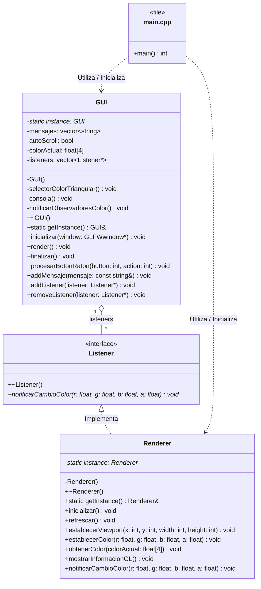

# Práctica 02: Renderer

**Asignatura:** Programación de Aplicaciones Gráficas (PAG)  
**Profesor:** Ángel Luis García Fernández  
**Alumno:** Juan Carlos Enríquez Muñoz  
**Año:** 2026

---

##  Resumen de Cambios Realizados

En esta práctica se ha extendido el motor gráfico desacoplando la interfaz de usuario de la lógica de renderizado mediante la integración de la biblioteca **Dear ImGui** y la implementación del patrón obsevador

### 1. Integración de Dear ImGui
* **Selector de Color de Fondo (`COLOR DE FONDO`):** Se ha añadido una ventana interactiva para modificar el color de fondo a través de un selector de color triangular.
* **Consola de Eventos Interna (`CONSOLA`):** Se ha diseñado una ventan con área de desplazamiento, botón de limpiado y checkbox de *auto-scroll* para mostrar los mensajes por consola de la aplicación directamente en la interfaz.

### 2. Arquitectura y Patrones de Diseño
* **Patrón Singleton:** Implementado en las clases `PAG::Renderer` y `PAG::GUI` para centralizar la gestión del motor gráfico y de la interfaz respectivamente.
* **Patrón Observador (Observer):**
    * **`PAG::Listener` (Interfaz/Abstracta):** Define el contrato `notificarCambioColor(r, g, b, a)` para los objetos interesados en reaccionar a cambios en la GUI.
    * **`PAG::GUI` (Sujeto/Publicador):** Gestiona la lista de observadores (`std::vector<Listener*>`). Al interactuar con la rueda de color, emite una notificación a los observadores sin tener dependencia directa de OpenGL o `PAG::Renderer`.
    * **`PAG::Renderer` (Observador Concreto):** Implementa `PAG::Listener` y se suscribe a `PAG::GUI` durante su método `inicializar()`. Al recibir la notificación, actualiza el estado de `glClearColor`.

### 3. Refactorización del Bucle Principal (`main.cpp`)
* Se han eliminado todas las llamadas directas a funciones OpenGL de `main.cpp`.
* El ciclo de renderizado llama ordenadamente a `PAG::Renderer::getInstance().refrescar()` seguido de `PAG::GUI::getInstance().render()`.

---

## Diagrama de Clases UML

El siguiente diagrama ilustra la relación de desacoplamiento entre `PAG::GUI` y `PAG::Renderer` a través de la interfaz `PAG::Listener`:

